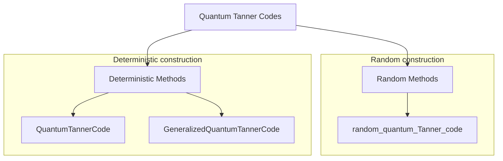
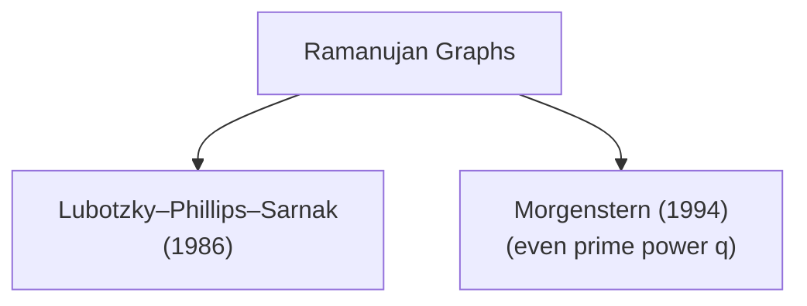

# QuantumExpanders.jl

<table>
    <tr>
        <td>Documentation</td>
        <td>
            <a href="https://quantumsavory.github.io/QuantumExpanders.jl/stable"></a>
            <a href="https://quantumsavory.github.io/QuantumExpanders.jl/dev"></a>
        </td>
    </tr><tr></tr>
    <tr>
        <td>Continuous integration</td>
        <td>
            <a href="https://github.com/QuantumSavory/QuantumExpanders.jl/actions?query=workflow%3ACI+branch%3Amaster"></a>
            <a href="https://buildkite.com/quantumsavory/QuantumExpanders"></a>
        </td>
    </tr><tr></tr>
    <tr>
        <td>Code coverage</td>
        <td>
            <a href="https://codecov.io/gh/QuantumSavory/QuantumExpanders.jl"></a>
        </td>
    </tr><tr></tr>
</table>

QuantumExpanders is a &nbsp;
    <a href="https://julialang.org">
        
        Julia Language
    </a>
    &nbsp; package for constructing quantum Tanner codes. To install QuantumExpanders,
    please <a href="https://docs.julialang.org/en/v1/manual/getting-started/">open
    Julia's interactive session (known as REPL)</a> and press the <kbd>]</kbd> key in the REPL to use the package mode, and then type:
</p>

```julia
pkg> add https://github.com/QuantumSavory/QuantumExpanders.jl.git
```

To update, just type `up` in the package mode.

The library provides the following methods to construct explicit instances of *quantum Tanner codes*.



## Quantum Tanner codes

Here is the novel `[[360, 61, (3, 10)]]` quantum Tanner code constructed from [Morgenstern Ramanujan graphs](https://www.sciencedirect.com/science/article/pii/S0095895684710549)
for even prime power q.

```julia
julia> l = 1; i = 2;

julia> q = 2^l
2

julia> Δ = q+1
3

julia> SL₂, B = morgenstern_generators(l, i)
[ Info: |SL₂(𝔽(4))| = 60
(SL(2,4), Oscar.MatrixGroupElem{Nemo.FqFieldElem, Nemo.FqMatrix}[[o+1 o+1; 1 o+1], [o+1 1; o+1 o+1], [o+1 o; o o+1]])

julia> A = alternative_morgenstern_generators(B, FirstOnly())
4-element Vector{Oscar.MatrixGroupElem{Nemo.FqFieldElem, Nemo.FqMatrix}}:
 [0 1; 1 o+1]
 [o+1 1; 1 0]
 [o+1 o+1; o 0]
 [0 o+1; o o+1]

julia> rng = MersenneTwister(892529278);

julia> hx, hz = random_quantum_Tanner_code(0.75, SL₂, A, B, rng=rng);
(length(group), length(A), length(B)) = (60, 4, 3)
length(group) * length(A) * length(B) = 720
[ Info: |V₀| = |V₁| = |G| = 60
[ Info: |E_A| = Δ|G| = 240, |E_B| = Δ|G| = 180
[ Info: |Q| = Δ²|G|/2 = 360
Hᴬ = [1 1 1 0]
Hᴮ = [0 1 1; 1 1 0]
Cᴬ = [1 1 0 0; 1 0 1 0; 0 0 0 1]
Cᴮ = [1 1 1]
size(Cˣ) = (3, 12)
size(Cᶻ) = (2, 12)
r1 = rank(𝒞ˣ) = 179
r2 = rank(𝒞ᶻ) = 120

julia> c = CSS(hx, hz);

julia> import JuMP; import HiGHS;

julia> code_n(c), code_k(c)
(360, 61)

julia> distance(c, DistanceMIPAlgorithm(solver = name ,logical_operator_type = :Z,time_limit = 900)), distance(c, DistanceMIPAlgorithm(solver = name ,logical_operator_type = :X,time_limit = 900))
(3, 10)
```

The library also provides two **explicit constructions** of Ramanujan graphs:



## Morgenstern Ramanujan graphs

Here we construct the Morgenstern Ramanujan graph `Γ = Cay(SL₂(𝔽_{qⁱ}), B)` for `l = 1, i = 2` (so `q = 2ˡ = 2`) and verify that it satisfies **all** the properties guaranteed by Theorem 5.13 of Morgenstern's [*Existence and Explicit Constructions of (q+1)-Regular Ramanujan Graphs for Every Prime Power q*](https://www.sciencedirect.com/science/article/pii/S0095895684710549), as well as the spectral expansion bounds of Claims 6.1 and 6.2 of
[Dinur et al. (2022), *Locally testable codes with constant rate, distance, and locality*](https://arxiv.org/abs/2111.04808).

```julia
julia> using QuantumExpanders, Oscar, LinearAlgebra;

julia> using Graphs: degree, vertices, nv, ne, is_bipartite, adjacency_matrix, diameter, is_connected, independent_set, has_edge, MaximalIndependentSet, greedy_color;

julia> using GraphsColoring: DSATUR, color, Greedy;

julia> using NautyGraphs: NautyGraph, is_isomorphic;

julia> using IGraphs: IGraph, IGVectorInt, LibIGraph;

julia> l = 1; i = 2;

julia> q = 2^l; r = q + 1; # q = 2, so Γ is 3-regular

julia> G, B = morgenstern_generators(l, i);
[ Info: |SL₂(𝔽(4))| = 60

julia> Γ = cayley_right(G, B);
```

**Generator set `B`.** The set `B` contains `q + 1` generators, each of determinant `1`
and order `2` (so `Γ` is an undirected simple graph):

```julia
julia> length(B) == q + 1
true

julia> all(det(b) == one(base_ring(b)) for b in B)
true

julia> all(matrix(b^2) == identity_matrix(base_ring(b), 2) for b in B)
true
```

**Property I: `(q+1)`-regularity and order `|Γ| = q³ⁱ − qⁱ`.**

```julia
julia> all(degree(Γ, v) == q + 1 for v in vertices(Γ))
true

julia> nv(Γ) == q^(3i) - q^i == 60
true

julia> is_connected(Γ)
true
```

**Property II: Non-bipartiteness.**

```julia
julia> is_bipartite(Γ)
false
```

**Property III: Ramanujan bound.** The trivial eigenvalue is `q + 1`, and every other
eigenvalue `μ` satisfies `|μ| ≤ 2√q`:

```julia
julia> λs = sort(real.(eigvals(Matrix(adjacency_matrix(Γ)))), rev=true);

julia> λs[1] ≈ q + 1
true

julia> all(abs(μ) ≤ 2√q + 1e-10 for μ in λs[2:end])
true
```

**Girth bound.** `g(Γ) ≥ (2/3)·log_q(|Γ|)`:

```julia
julia> girth_lower_bound = floor(Int, (2/3)*log(q, nv(Γ)));

julia> g_igraph = IGraph(Γ); girth_val = Ref{LibIGraph.igraph_real_t}(0.0); cycle = IGVectorInt();

julia> LibIGraph.igraph_girth(g_igraph.objref, girth_val, cycle.objref);

julia> Int(girth_val[]) >= girth_lower_bound
true
```

**Property IV: Diameter bound.** `diam(Γ) ≤ 2·log_q(|Γ|) + 2`:

```julia
julia> diameter(Γ) ≤ ceil(Int, 2*log(q, nv(Γ)) + 2)
true
```

**Property V: Chromatic number.** `χ(Γ) ≥ (q+1)/(2√q) + 1`:

```julia
julia> χ_lower_bound = (q + 1)/(2√q) + 1;

julia> greedy_color(Γ; sort_degree=false, reps=1000).num_colors >= χ_lower_bound
true

julia> length(color(Γ; algorithm=DSATUR()).colors) >= χ_lower_bound
true

julia> length(color(Γ; algorithm=Greedy()).colors) >= χ_lower_bound
true
```

**Property VI: Independence number.** `i(Γ) ≤ (2√q/(q+1))·|Γ|`:

```julia
julia> ind_set = independent_set(Γ, MaximalIndependentSet());

julia> length(ind_set) ≤ ceil(Int, (2√q/(q + 1))*nv(Γ))
true

julia> all(u == v || !has_edge(Γ, u, v) for u in ind_set, v in ind_set)
true
```

**Expander properties.** `Γ` is an `(n, r, 1 − λ²/r²)`-expander with
`λ = max_{μ ≠ q+1} |μ|`, where `λ ≤ r − d²/8r` and `λ ≤ 2√(r−1)` (optimality):

```julia
julia> λ = maximum(abs.(λs[2:end]));

julia> d = 1 - λ^2/r^2; d > 0;

julia> λ ≤ r - d^2/(8r) + 1e-10
true

julia> λ ≤ 2√(r - 1) + 1e-10
true
```

### Spectral expansion of the alternative generator sets

The alternative generator sets `A = alternative_morgenstern_generators(B, ...)` used in
the quantum Tanner code construction also satisfy the explicit second-eigenvalue bounds
of [Dinur et al. (2022)](https://arxiv.org/abs/2111.04808):

```julia
julia> A₁ = alternative_morgenstern_generators(B, AllPairs()); # Claim 6.1 (ii): AllPairs generators, degree k₁ = q² + q

julia> Γ₁ = cayley_right(G, A₁);

julia> λ₂ = sort(real.(eigvals(Matrix(adjacency_matrix(Γ₁))/(q^2 + q))), rev=true)[2];

julia> λ₂ < (3q - 1)/(q^2 + q)
true

julia> A₂ = alternative_morgenstern_generators(B, FirstOnly()); # Claim 6.2: FirstOnly generators, degree k₁ = 2q

julia> Γ₂ = cayley_right(G, A₂);

julia> λ₂ = sort(real.(eigvals(Matrix(adjacency_matrix(Γ₂))/(2q))), rev=true)[2];

julia> λ₂ < 3√(2q - 1)/(2q)
true
```

## Lubotzky–Phillips–Sarnak (LPS) Ramanujan graphs

The LPS construction gives explicit `(p+1)`-regular Ramanujan graphs `Xᵖ˒ᑫ` for primes `p, q ≡ 1 (mod 4)` with `p ≠ q`. The structure of the graph depends on the Legendre symbol `(p/q)`: when `(p/q) = 1` the graph is the *non-bipartite* Cayley graph of `PSL₂(𝔽_q)` with `|Xᵖ˒ᑫ| = q(q² − 1)/2`, and when `(p/q) = −1` it is the *bipartite* Cayley graph of `PGL₂(𝔽_q)` with `|Xᵖ˒ᑫ| = q(q² − 1)`.

Here we construct the LPS Ramanujan graph for `p = 13, q = 17` and verify thepr operties established on page 263 of
[Lubotzky, Phillips, and Sarnak (1988), *Ramanujan graphs*](https://link.springer.com/article/10.1007/BF02126799).

```julia
julia> using QuantumExpanders, Oscar, LinearAlgebra

julia> using QuantumExpanders: legendre_symbol, is_ramanujan; # and same libraries as above

julia> p = 13; q = 17;

julia> legendre_symbol(p, q) # (p/q) = 1: non-bipartite PSL₂(𝔽_q) case
1

julia> X = LPS(p, q);

julia> n = q*(q^2 - 1)÷2 # |PSL₂(𝔽₁₇)| = 2448
2448
```

**`(p+1)`-regularity, order, and connectivity.**

```julia
julia> all(degree(X, v) == p + 1 for v in vertices(X))
true

julia> nv(X) == n
true

julia> is_connected(X)
true
```

**Ramanujan bound.** The trivial eigenvalue is `p + 1`, and every other eigenvalue
`μ` satisfies `|μ| ≤ 2√p`:

```julia
julia> λs = sort(real.(eigvals(Matrix(adjacency_matrix(X)))), rev=true);

julia> λs[1] ≈ p + 1
true

julia> all(abs(μ) ≤ 2√p + 1e-10 for μ in λs[2:end])
true
```

The same check is available as a convenience predicate:

```julia
julia> is_ramanujan(X, p)
true
```

**Non-bipartiteness.** Since `(p/q) = 1`, the graph is non-bipartite (case ii):

```julia
julia> is_bipartite(X)
false
```

**Girth bound (case ii (a)).** `g(Xᵖ˒ᑫ) ≥ 2·log_p(q)`:

```julia
julia> girth_lower_bound = floor(Int, 2*log(p, q));

julia> g_igraph = IGraph(X); girth_val = Ref{LibIGraph.igraph_real_t}(0.0); cycle = IGVectorInt();

julia> LibIGraph.igraph_girth(g_igraph.objref, girth_val, cycle.objref);

julia> Int(girth_val[]) >= girth_lower_bound
true
```

**Diameter bound (case ii (b)).** `diam(Xᵖ˒ᑫ) ≤ 2·log_p(n) + 2·log_p(2) + 1`:

```julia
julia> diameter(X) ≤ ceil(Int, 2*log(p, n) + 2*log(p, 2) + 1)
true
```

**Independence number (case ii (c)).** `i(Xᵖ˒ᑫ) ≤ (2√p/(p+1))·n`:

```julia
julia> ind_set = independent_set(X, MaximalIndependentSet());

julia> length(ind_set) ≤ ceil(Int, (2√p/(p + 1))*n)
true
```

When `(p/q) = −1`, the graph is instead the bipartite Cayley graph of
`PGL₂(𝔽_q)` on `q(q² − 1)` vertices, satisfying the corresponding case i bounds:
girth `g(Xᵖ˒ᑫ) ≥ 4·log_p(q) − log_p(4)` and the same diameter bound.

## Support

QuantumExpanders.jl is developed by [many volunteers](https://github.com/QuantumSavory/QuantumExpanders.jl/graphs/contributors), managed at [Prof. Krastanov's lab](https://lab.krastanov.org/) at [University of Massachusetts Amherst](https://www.umass.edu/quantum/).

The development effort is supported by The [NSF Engineering and Research Center for Quantum Networks](https://cqn-erc.arizona.edu/), and
by NSF Grant 2346089 "Research Infrastructure: CIRC: New: Full-stack Codesign Tools for Quantum Hardware".

## Bounties

[We run many bug bounties and encourage submissions from novices (we are happy to help onboard you in the field).](https://github.com/QuantumSavory/.github/blob/main/BUG_BOUNTIES.md)
