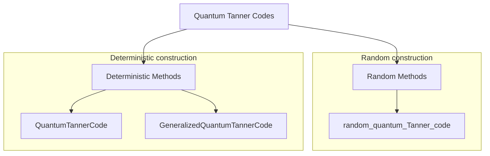

# QuantumExpanders.jl

<table>
    <tr>
        <td>Documentation</td>
        <td>
            <a href="https://quantumsavory.github.io/QuantumExpanders.jl/stable"></a>
            <a href="https://quantumsavory.github.io/QuantumExpanders.jl/dev"></a>
        </td>
    </tr><tr></tr>
    <tr>
        <td>Continuous integration</td>
        <td>
            <a href="https://github.com/QuantumSavory/QuantumExpanders.jl/actions?query=workflow%3ACI+branch%3Amaster"></a>
            <a href="https://buildkite.com/quantumsavory/QuantumExpanders"></a>
        </td>
    </tr><tr></tr>
    <tr>
        <td>Code coverage</td>
        <td>
            <a href="https://codecov.io/gh/QuantumSavory/QuantumExpanders.jl"></a>
        </td>
    </tr><tr></tr>
</table>

QuantumExpanders is a &nbsp;
    <a href="https://julialang.org">
        
        Julia Language
    </a>
    &nbsp; package for constructing quantum Tanner codes. To install QuantumExpanders,
    please <a href="https://docs.julialang.org/en/v1/manual/getting-started/">open
    Julia's interactive session (known as REPL)</a> and press the <kbd>]</kbd> key in the REPL to use the package mode, and then type:
</p>

```julia
pkg> add https://github.com/QuantumSavory/QuantumExpanders.jl.git
```

To update, just type `up` in the package mode.

The library provides the following methods to construct explicit instances of *quantum Tanner codes*.


Here is the novel `[[360, 61, (3, 10)]]` quantum Tanner code constructed from [Morgenstern Ramanujan graphs](https://www.sciencedirect.com/science/article/pii/S0095895684710549)
for even prime power q.

```julia
julia> l = 1; i = 2;

julia> q = 2^l
2

julia> Δ = q+1
3

julia> SL₂, B = morgenstern_generators(l, i)
[ Info: |SL₂(𝔽(4))| = 60
(SL(2,4), Oscar.MatrixGroupElem{Nemo.FqFieldElem, Nemo.FqMatrix}[[o+1 o+1; 1 o+1], [o+1 1; o+1 o+1], [o+1 o; o o+1]])

julia> A = alternative_morgenstern_generators(B, FirstOnly())
4-element Vector{Oscar.MatrixGroupElem{Nemo.FqFieldElem, Nemo.FqMatrix}}:
 [0 1; 1 o+1]
 [o+1 1; 1 0]
 [o+1 o+1; o 0]
 [0 o+1; o o+1]

julia> rng = MersenneTwister(892529278);

julia> hx, hz = random_quantum_Tanner_code(0.75, SL₂, A, B, rng=rng);
(length(group), length(A), length(B)) = (60, 4, 3)
length(group) * length(A) * length(B) = 720
[ Info: |V₀| = |V₁| = |G| = 60
[ Info: |E_A| = Δ|G| = 240, |E_B| = Δ|G| = 180
[ Info: |Q| = Δ²|G|/2 = 360
Hᴬ = [1 1 1 0]
Hᴮ = [0 1 1; 1 1 0]
Cᴬ = [1 1 0 0; 1 0 1 0; 0 0 0 1]
Cᴮ = [1 1 1]
size(Cˣ) = (3, 12)
size(Cᶻ) = (2, 12)
r1 = rank(𝒞ˣ) = 179
r2 = rank(𝒞ᶻ) = 120

julia> c = CSS(hx, hz);

julia> import JuMP; import HiGHS;

julia> code_n(c), code_k(c)
(360, 61)

julia> distance(c, DistanceMIPAlgorithm(solver = name ,logical_operator_type = :Z,time_limit = 900)), distance(c, DistanceMIPAlgorithm(solver = name ,logical_operator_type = :X,time_limit = 900))
(3, 10)
```

## Support

QuantumExpanders.jl is developed by [many volunteers](https://github.com/QuantumSavory/QuantumExpanders.jl/graphs/contributors), managed at [Prof. Krastanov's lab](https://lab.krastanov.org/) at [University of Massachusetts Amherst](https://www.umass.edu/quantum/).

The development effort is supported by The [NSF Engineering and Research Center for Quantum Networks](https://cqn-erc.arizona.edu/), and
by NSF Grant 2346089 "Research Infrastructure: CIRC: New: Full-stack Codesign Tools for Quantum Hardware".

## Bounties

[We run many bug bounties and encourage submissions from novices (we are happy to help onboard you in the field).](https://github.com/QuantumSavory/.github/blob/main/BUG_BOUNTIES.md)
