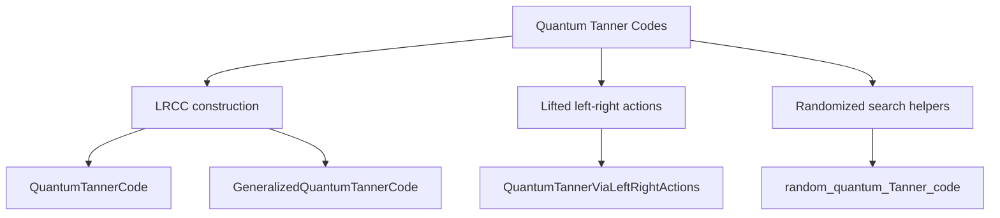

# QuantumExpanders.jl

[](https://quantumsavory.github.io/QuantumExpanders.jl/stable)
[](https://quantumsavory.github.io/QuantumExpanders.jl/dev)
[](https://github.com/QuantumSavory/QuantumExpanders.jl/actions/workflows/ci.yml)
[](https://codecov.io/gh/QuantumSavory/QuantumExpanders.jl)

QuantumExpanders is a &nbsp;
    <a href="https://julialang.org">
        
        Julia Language
    </a>
    &nbsp; package for constructing quantum Tanner (QT) codes and the finite-group expander graphs used to build them. It integrates with
[Oscar.jl](https://www.oscar-system.org/),
[QECCore.jl](https://github.com/QuantumSavory/QECCore.jl), and
[QuantumClifford.jl](https://github.com/QuantumSavory/QuantumClifford.jl), so a
constructed code can be used directly with the broader QuantumSavory ecosystem.
</p>

The package implements two constructions of quantum Tanner codes: the
square-complex construction `QuantumTannerCode` and the lifted construction
`QuantumTannerViaLeftRightActions`. Together they build every code in
[*Quantum Tanner Codes at Moderate Blocklength*](https://arxiv.org/abs/2608.12509).

## Installation

The package is currently installed directly from GitHub:

```julia
pkg> add https://github.com/QuantumSavory/QuantumExpanders.jl.git
```

Julia 1.12 or later is required.

## Quick start

This small lifted example uses the group `C₂`, the local repetition code, and
one copy of each group element in both multisets:

```julia
using QuantumExpanders, Oscar

G = cyclic_group(2)
g = gens(G)[1]
A = [one(G), g]
B = [one(G), g]
H = [1 1]

code = QuantumTannerViaLeftRightActions(G, A, B, H, H)

code_n(code), code_k(code)       # (8, 2)
hx, hz = parity_matrix_xz(code)
iszero(mod.(hx * hz', 2))        # true
```

The constructor returns an `AbstractCSSCode`, so standard functions such as
`parity_matrix_x`, `parity_matrix_z`, `code_n`, and `code_k` work directly.

## Construction methods


```mermaid
flowchart TD
    QT["Quantum Tanner Codes"]

    QT --> LRCC["LRCC construction"]
    QT --> Lifted["Lifted left-right actions"]
    QT --> Search["Randomized search helpers"]

    LRCC --> QTC["QuantumTannerCode"]
    LRCC --> GQTC["GeneralizedQuantumTannerCode"]

    Lifted --> LRA["QuantumTannerViaLeftRightActions"]

    Search --> RQTC["random_quantum_Tanner_code"]
```

The lifted construction is equivalent to the square-complex construction of
Leverrier & Zémor, but presents the code via commuting left and right actions
rather than as classical Tanner codes on a square complex. This is much more
convenient for search: multisets that maximise the classical Tanner distance on
each `A`-slice and `B`-slice can be selected cheaply, before the more expensive
quantum distance estimation runs. Every code in the main text of
[our paper](https://arxiv.org/abs/2608.12509) is built through
`QuantumTannerViaLeftRightActions`; see the
[lifted construction guide](https://quantumsavory.github.io/QuantumExpanders.jl/dev/quantum_tanner_left_right_actions/)
for a worked `[[756, 10]]` example and the full argument mapping.

## Which constructor should I use?

| Goal | Constructor |
|---|---|
| Build from an explicit left-right Cayley complex | `QuantumTannerCode` |
| Use commuting left/right actions, multisets, or column permutations | `QuantumTannerViaLeftRightActions` |
| Generate random local codes for an LRCC | `random_quantum_Tanner_code` |
| Construct a Morgenstern or LPS Ramanujan graph | `morgenstern_generators` or `LPS` |

Start with the
[Getting started](https://quantumsavory.github.io/QuantumExpanders.jl/dev/getting_started/)
guide, then see the dedicated pages for the
[LRCC construction](https://quantumsavory.github.io/QuantumExpanders.jl/dev/quantum_tanner/)
and the
[lifted construction](https://quantumsavory.github.io/QuantumExpanders.jl/dev/quantum_tanner_left_right_actions/).

## Ramanujan graphs

The library provides two explicit constructions of Ramanujan graphs used to build
the codes:

- **Morgenstern** `(q+1)`-regular graphs for even prime power `q`, via
  `morgenstern_generators` / `alternative_morgenstern_generators`; and
- **Lubotzky-Phillips-Sarnak** `(p+1)`-regular graphs `Xᵖ˒ᑫ` for primes
  `p, q ≡ 1 (mod 4)`, via `LPS`.

The documentation verifies that both families satisfy the properties guaranteed
by their source theorems, including regularity, order, connectivity, the Ramanujan
spectral bound, girth, diameter, chromatic and independence bounds, and the
second-eigenvalue expansion bounds of
[Dinur et al. (2022)](https://arxiv.org/abs/2111.04808). See the
[Morgenstern graphs](https://quantumsavory.github.io/QuantumExpanders.jl/dev/)
and [LPS graphs](https://quantumsavory.github.io/QuantumExpanders.jl/dev/)
pages for the full checks.

## Data and reproducing the paper's codes

The explicit code instances reported in
[*Quantum Tanner Codes at Moderate Blocklength*](https://arxiv.org/abs/2608.12509),
including their groups, generator multisets, local codes, and parity-check data,
are collected in the companion data repository
[**QuantumSavory/Quantum-Tanner-Codes-at-Moderate-Blocklength**](https://github.com/QuantumSavory/Quantum-Tanner-Codes-at-Moderate-Blocklength).
Use it together with `QuantumExpanders.jl` to rebuild any published code from its
recorded constructor arguments.

The documentation mention how the published data map to constructor arguments and
how to verify blocklength, dimension, CSS orthogonality, stabilizer rank, and check
weights. Randomized distance estimates are reported as upper bounds. See
[Reproducing the manuscript instances](https://quantumsavory.github.io/QuantumExpanders.jl/dev/paper_instances/).

Distance estimation on the larger codes uses external tools such as
[sqetch](https://github.com/a7b/yarn) (GPU random-ISD estimator) or
[QDistRnd](https://github.com/QEC-pages/QDistRnd) (GAP-based).

## Citation

If you use the moderate-blocklength QT constructions or the accompanying code
data, please cite:

```bibtex
@article{mian2026quantum,
  title   = {Quantum Tanner Codes at Moderate Blocklength},
  author  = {Mian, Feroz Ahmed and Addala, Vaishnavi L. and Meraj, Arman and
             Chadha, Adhiraj and Krastanov, Stefan},
  journal = {arXiv preprint arXiv:2608.12509},
  year    = {2026}
}
```

The code data are archived at
[QuantumSavory/Quantum-Tanner-Codes-at-Moderate-Blocklength](https://github.com/QuantumSavory/Quantum-Tanner-Codes-at-Moderate-Blocklength).

## Contributing and support

Bug reports, documentation improvements, and pull requests are welcome through
the [GitHub issue tracker](https://github.com/QuantumSavory/QuantumExpanders.jl/issues).
The project is developed by [many volunteers](https://github.com/QuantumSavory/QuantumExpanders.jl/graphs/contributors),
managed at [Prof. Krastanov's lab](https://lab.krastanov.org/) at the
[University of Massachusetts Amherst](https://www.umass.edu/quantum/).

The development effort is supported by the
[NSF Engineering and Research Center for Quantum Networks](https://cqn-erc.arizona.edu/),
and by NSF Grant 2346089 "Research Infrastructure: CIRC: New: Full-stack Codesign
Tools for Quantum Hardware".

See [`CHANGELOG.md`](CHANGELOG.md) for the paper-related features and fixes in the
current development branch.

## Bounties

[We run many bug bounties and encourage submissions from novices (we are happy to
help onboard you in the field).](https://github.com/QuantumSavory/.github/blob/main/BUG_BOUNTIES.md)
