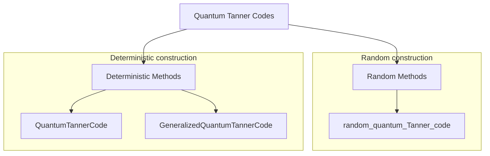

# QuantumExpanders.jl

A Julia library for constructing quantum Tanner codes and related expander-based quantum LDPC codes, built on top of [Oscar](https://www.oscar-system.org/), [QECCore](https://github.com/QuantumSavory/QECCore.jl), and [QuantumClifford](https://github.com/QuantumSavory/QuantumClifford.jl).

The library provides the following methods to construct explicit instances of *quantum Tanner codes*.



## Quick Example

Constructing a random quantum Tanner code from Morgenstern generators of ``SL_2(\mathbb{F}_4)``:

```julia
julia> using QuantumExpanders, Oscar, QuantumClifford, QuantumClifford.ECC, QECCore

julia> using Random: MersenneTwister

julia> l = 1; i = 2;

julia> q = 2^l
2

julia> Δ = q + 1
3

julia> SL₂, B = morgenstern_generators(l, i)
[ Info: |SL₂(𝔽(4))| = 60
(SL(2,4), Oscar.MatrixGroupElem{Nemo.FqFieldElem, Nemo.FqMatrix}[[o+1 o+1; 1 o+1], [o+1 1; o+1 o+1], [o+1 o; o o+1]])

julia> A = alternative_morgenstern_generators(B, FirstOnly())
4-element Vector{Oscar.MatrixGroupElem{Nemo.FqFieldElem, Nemo.FqMatrix}}:
 [0 1; 1 o+1]
 [o+1 1; 1 0]
 [o+1 o+1; o 0]
 [0 o+1; o o+1]

julia> rng = MersenneTwister(892529278);

julia> hx, hz = random_quantum_Tanner_code(0.75, SL₂, A, B, rng=rng);
(length(group), length(A), length(B)) = (60, 4, 3)
length(group) * length(A) * length(B) = 720
[ Info: |V₀| = |V₁| = |G| = 60
[ Info: |E_A| = Δ|G| = 240, |E_B| = Δ|G| = 180
[ Info: |Q| = Δ²|G|/2 = 360
Hᴬ = [1 1 1 0]
Hᴮ = [0 1 1; 1 1 0]
Cᴬ = [1 1 0 0; 1 0 1 0; 0 0 0 1]
Cᴮ = [1 1 1]
size(Cˣ) = (3, 12)
size(Cᶻ) = (2, 12)
r1 = rank(𝒞ˣ) = 179
r2 = rank(𝒞ᶻ) = 120
```

The resulting parity check matrices define a CSS code whose parameters can be computed with `QECCore` and `QuantumClifford.ECC`:

```julia
julia> c = CSS(hx, hz);

julia> import JuMP; import HiGHS;

julia> code_n(c), code_k(c)
(360, 61)

julia> distance(c, DistanceMIPAlgorithm(solver = HiGHS.Optimizer, logical_operator_type = :Z, time_limit = 900)),
       distance(c, DistanceMIPAlgorithm(solver = HiGHS.Optimizer, logical_operator_type = :X, time_limit = 900))
(3, 10)
```