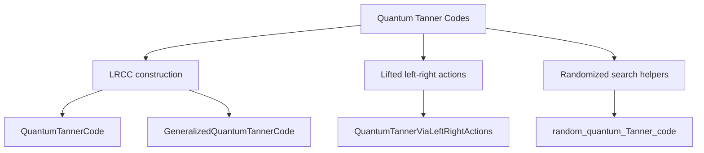
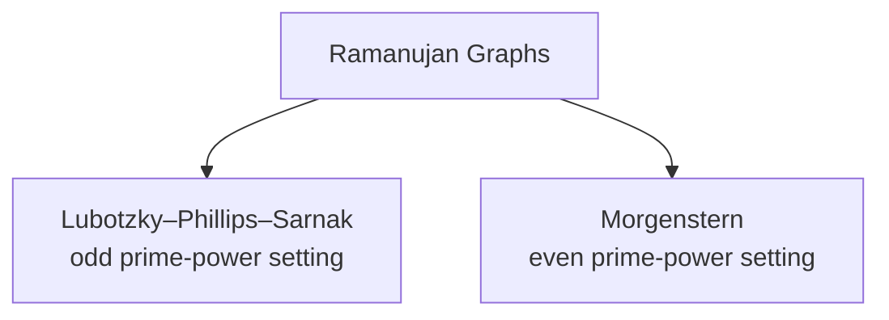

# QuantumExpanders.jl

`QuantumExpanders.jl` is a Julia library for constructing **quantum Tanner codes**
and related expander-based quantum LDPC codes. It is built on top of
[Oscar](https://www.oscar-system.org/),
[QECCore](https://github.com/QuantumSavory/QECCore.jl), and
[QuantumClifford](https://github.com/QuantumSavory/QuantumClifford.jl).

The package supports both the original **left-right Cayley complex (LRCC)**
description of quantum Tanner codes and the newer **lifted left-right action**
description. It also provides explicit constructions of Ramanujan graphs that
can be used independently of the quantum-code routines.

For background on quantum Tanner codes, see [Quantum Tanner Codes](@ref quantum-tanner-codes).

## Quantum Tanner code constructions


```mermaid
flowchart TD
    QT["Quantum Tanner Codes"]

    QT --> LRCC["LRCC construction"]
    QT --> Lifted["Lifted left-right actions"]
    QT --> Search["Randomized search helpers"]

    LRCC --> QTC["QuantumTannerCode"]
    LRCC --> GQTC["GeneralizedQuantumTannerCode"]

    Lifted --> LRA["QuantumTannerViaLeftRightActions"]

    Search --> RQTC["random_quantum_Tanner_code"]
```

### [`QuantumTannerCode`](@ref)

Constructs a quantum Tanner code directly from the **bipartite LRCC**. This is
the geometric square-complex description and requires symmetric generating sets
satisfying the total non-conjugacy condition.

### [`QuantumTannerViaLeftRightActions`](@ref)

Constructs the same QT-code framework from the **lifted algebraic description**,
using commuting left and right regular actions of a finite group. This form is
especially useful for explicit code searches, repeated group elements, and
independent local-code lengths.

### `random_quantum_Tanner_code`

Provides a convenient randomized interface for generating local codes and
constructing LRCC-based quantum Tanner codes from a chosen group and generating
sets.

## LRCC quick example

The following example constructs a quantum Tanner code using explicit
[Morgenstern generators](@ref morgenstern-graphs) of
``\mathrm{SL}_2(\mathbb{F}_4)``.

```julia
julia> using QuantumExpanders, Oscar, QECCore, QuantumClifford, QuantumClifford.ECC

julia> using Random: MersenneTwister

julia> l = 1; i = 2;

julia> SL₂, B = morgenstern_generators(l, i);

julia> A = alternative_morgenstern_generators(B, FirstOnly());

julia> rng = MersenneTwister(892529278);

julia> hx, hz = random_quantum_Tanner_code(
           0.75,
           SL₂,
           A,
           B;
           rng = rng,
       );

julia> c = CSS(hx, hz);

julia> code_n(c), code_k(c)
(360, 61)
```

The parity-check matrices can be passed directly to the rest of the
`QECCore` / `QuantumClifford.ECC` ecosystem. For example, one may estimate or
compute distances using any supported distance algorithm:

```julia
julia> import JuMP; import HiGHS

julia> dz = distance(
           c,
           DistanceMIPAlgorithm(
               solver = HiGHS.Optimizer,
               logical_operator_type = :Z,
               time_limit = 900,
           ),
       );

julia> dx = distance(
           c,
           DistanceMIPAlgorithm(
               solver = HiGHS.Optimizer,
               logical_operator_type = :X,
               time_limit = 900,
           ),
       );

julia> (dx, dz)
(10, 3)
```

## Lifted quantum Tanner code example

The lifted construction works directly with commuting left and right actions of a
finite group. For example, the following reconstructs a ``[[288, 8, (≤ 15, ≤ 15)]]`` quantum
Tanner code over ``S_3``:

```julia
julia> using QuantumExpanders, Oscar, QECCore

julia> G = codomain(isomorphism(PermGroup, small_group(6, 1)));

julia> A = [
           one(G),
           one(G),
           cperm(G, [2,3]),
           cperm(G, [2,3]),
           cperm(G, [1,2,3]),
           cperm(G, [1,2]),
           cperm(G, [1,2]),
           cperm(G, [1,3,2]),
       ];

julia> B = [
           one(G),
           one(G),
           cperm(G, [2,3]),
           cperm(G, [1,2,3]),
           cperm(G, [1,2]),
           cperm(G, [1,3,2]),
       ];

julia> H844 = [
           1 0 0 0 0 1 1 1;
           0 1 0 0 1 0 1 1;
           0 0 1 0 1 1 0 1;
           0 0 0 1 1 1 1 0
       ];

julia> G844 = [
           0 1 1 1 1 0 0 0;
           1 0 1 1 0 1 0 0;
           1 1 0 1 0 0 1 0;
           1 1 1 0 0 0 0 1
       ];

julia> H633 = [
           1 0 0 0 1 1;
           0 1 0 1 0 1;
           0 0 1 1 1 0
       ];

julia> G633 = [
           0 1 1 1 0 0;
           1 0 1 0 1 0;
           1 1 0 0 0 1
       ];

julia> c = QuantumTannerViaLeftRightActions(
           G,
           A,
           B,
           H844,
           G844,
           H633,
           G633;
           p1 = 1:8,
           p2 = [1,2,4,3,6,5],
       );

julia> code_n(c), code_k(c)
(288, 8)
```

The corresponding CSS parity-check matrices are available through

```julia
julia> hx, hz = parity_matrix_xz(c);
```

For the construction itself, the meaning of the multisets ``A,B``, the column
permutations ``p1,p2``, and the left/right regular actions are described on the
dedicated [`QuantumTannerViaLeftRightActions`](@ref) documentation page.

## Explicit Ramanujan graph constructions

`QuantumExpanders.jl` also implements two explicit families of Ramanujan graphs:


```mermaid
flowchart TB
    R["Ramanujan Graphs"]

    R --> LPS["Lubotzky–Phillips–Sarnak<br/>odd prime-power setting"]
    R --> Morgenstern["Morgenstern<br/>even prime-power setting"]
```

These graph constructions can be used independently of the quantum Tanner code
routines.

- [Lubotzky–Phillips–Sarnak](@ref lps-graphs)
- [Morgenstern](@ref morgenstern-graphs)

The corresponding documentation pages include worked examples and utilities for
studying spectral expansion, girth, diameter, chromatic number, and independence
properties.

## Package overview

The main workflows are:

- construct QT codes directly from LRCC data with [`QuantumTannerCode`](@ref);
- construct lifted QT codes with [`QuantumTannerViaLeftRightActions`](@ref);
- generate candidate QT codes with `random_quantum_Tanner_code`;
- construct explicit LPS and Morgenstern Ramanujan graphs;
- pass the resulting CSS parity-check matrices to `QECCore` and
  `QuantumClifford.ECC` for code analysis and decoding workflows.

## References

```@bibliography
Pages = ["index.md"]
Canonical = false
```
