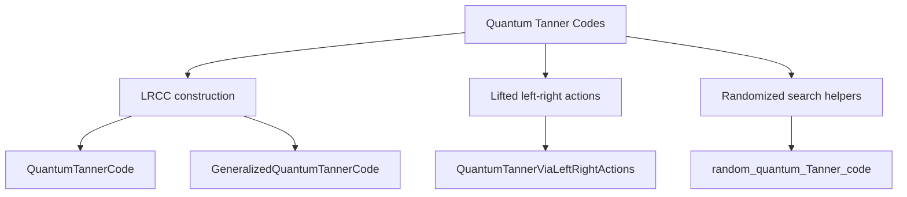
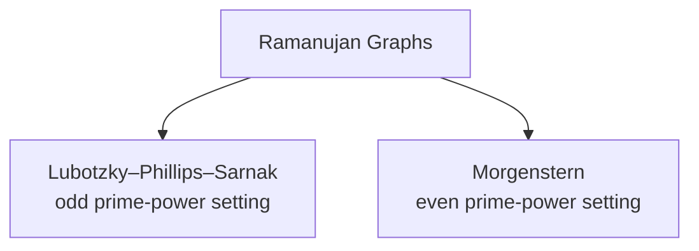

# QuantumExpanders.jl

`QuantumExpanders.jl` is a Julia library for constructing quantum Tanner (QT)
codes and the finite-group expander graphs used to build them. The package is
built on [Oscar](https://www.oscar-system.org/),
[QECCore](https://github.com/QuantumSavory/QECCore.jl), and
[QuantumClifford](https://github.com/QuantumSavory/QuantumClifford.jl).

The library supports two complementary descriptions of QT codes:

- the **left-right Cayley complex (LRCC)** description, implemented by
  [`QuantumTannerCode`](@ref); and
- the **lifted left-right action** description, implemented by
  [`QuantumTannerViaLeftRightActions`](@ref).

It also implements explicit [Morgenstern](@ref morgenstern-graphs) and
[Lubotzky-Phillips-Sarnak](@ref lps-graphs) Ramanujan graph families.

!!! info "Connection to the manuscript"
    The code instances from [*Quantum Tanner Codes at Moderate
    Blocklength*](https://arxiv.org/abs/2608.12509) are reconstructed in the
    package's regression tests. See [Reproducing the manuscript
    instances](@ref paper-instances) for the mapping from published data to
    constructor inputs and for an explanation of the randomized distance
    bounds.

## Start here

If this is your first visit, follow the pages in this order:

1. [Getting started](@ref getting-started) — install the package, construct a
   small code, and inspect its CSS matrices.
2. [Quantum Tanner Codes](@ref quantum-tanner-codes) — learn the LRCC geometry
   and the role of the local tensor codes.
3. [Quantum Tanner Codes via Left-Right Actions](@ref quantum-tanner-left-right-actions)
   — learn the lifted construction and its three constructors.
4. [Reproducing the manuscript instances](@ref paper-instances) — reproduce
   and validate the published moderate-blocklength examples.


## Choose a workflow

| If you have... | Start with... | Main requirement |
|---|---|---|
| An LRCC group and symmetric generating sets | [`QuantumTannerCode`](@ref) | The generating sets satisfy the LRCC conditions |
| Group elements that may repeat, or two unequal local-code lengths | [`QuantumTannerViaLeftRightActions`](@ref) | Each local parity-check/generator pair is dual |
| An even prime power and want explicit optimal expanders | [`morgenstern_generators`](@ref) | The extension degree is even |
| Suitable odd primes ``p,q`` | [`LPS`](@ref) | ``p,q\equiv1\pmod4`` and ``p\ne q`` |

All code constructors return an `AbstractCSSCode`. Once a code is constructed,
the standard interface is available:

```julia
hx = parity_matrix_x(code)
hz = parity_matrix_z(code)
n = code_n(code)
k = code_k(code)
```

The resulting objects can be passed to QuantumClifford distance algorithms,
decoders, and circuit tools without a package-specific conversion step.

## Quantum Tanner code constructions


```mermaid
flowchart TD
    QT["Quantum Tanner Codes"]

    QT --> LRCC["LRCC construction"]
    QT --> Lifted["Lifted left-right actions"]
    QT --> Search["Randomized search helpers"]

    LRCC --> QTC["QuantumTannerCode"]
    LRCC --> GQTC["GeneralizedQuantumTannerCode"]

    Lifted --> LRA["QuantumTannerViaLeftRightActions"]

    Search --> RQTC["random_quantum_Tanner_code"]
```

### [`QuantumTannerCode`](@ref)

Constructs a quantum Tanner code directly from the **bipartite LRCC**. This is
the geometric square-complex description and requires symmetric generating sets
satisfying the total non-conjugacy condition.

### [`QuantumTannerViaLeftRightActions`](@ref)

Constructs the same QT-code framework from the **lifted algebraic description**,
using commuting left and right regular actions of a finite group. This form is
especially useful for explicit code searches, repeated group elements, and
independent local-code lengths.

### `random_quantum_Tanner_code`

Provides a convenient randomized interface for generating local codes and
constructing LRCC-based quantum Tanner codes from a chosen group and generating
sets.

## LRCC quick example

The following example constructs a quantum Tanner code using explicit
[Morgenstern generators](@ref morgenstern-graphs) of
``\mathrm{SL}_2(\mathbb{F}_4)``.

```julia
julia> using QuantumExpanders, Oscar, QECCore, QuantumClifford, QuantumClifford.ECC

julia> using Random: MersenneTwister

julia> l = 1; i = 2;

julia> SL₂, B = morgenstern_generators(l, i);

julia> A = alternative_morgenstern_generators(B, FirstOnly());

julia> rng = MersenneTwister(892529278);

julia> hx, hz = random_quantum_Tanner_code(
           0.75,
           SL₂,
           A,
           B;
           rng = rng,
       );

julia> c = CSS(hx, hz);

julia> code_n(c), code_k(c)
(360, 61)
```

The parity-check matrices can be passed directly to the rest of the
`QECCore` / `QuantumClifford.ECC` ecosystem. For example, one may estimate or
compute distances using any supported distance algorithm:

```julia
julia> import JuMP; import HiGHS

julia> dz = distance(
           c,
           DistanceMIPAlgorithm(
               solver = HiGHS.Optimizer,
               logical_operator_type = :Z,
               time_limit = 900,
           ),
       );

julia> dx = distance(
           c,
           DistanceMIPAlgorithm(
               solver = HiGHS.Optimizer,
               logical_operator_type = :X,
               time_limit = 900,
           ),
       );

julia> (dx, dz)
(10, 3)
```

## Lifted quantum Tanner code example

The lifted construction works directly with commuting left and right actions of a
finite group. For example, the following reconstructs a ``[[288, 8, (≤ 15, ≤ 15)]]`` quantum
Tanner code over ``S_3``:

```julia
julia> using QuantumExpanders, Oscar, QECCore

julia> G = codomain(isomorphism(PermGroup, small_group(6, 1)));

julia> A = [
           one(G),
           one(G),
           cperm(G, [2,3]),
           cperm(G, [2,3]),
           cperm(G, [1,2,3]),
           cperm(G, [1,2]),
           cperm(G, [1,2]),
           cperm(G, [1,3,2]),
       ];

julia> B = [
           one(G),
           one(G),
           cperm(G, [2,3]),
           cperm(G, [1,2,3]),
           cperm(G, [1,2]),
           cperm(G, [1,3,2]),
       ];

julia> H844 = [
           1 0 0 0 0 1 1 1;
           0 1 0 0 1 0 1 1;
           0 0 1 0 1 1 0 1;
           0 0 0 1 1 1 1 0
       ];

julia> G844 = [
           0 1 1 1 1 0 0 0;
           1 0 1 1 0 1 0 0;
           1 1 0 1 0 0 1 0;
           1 1 1 0 0 0 0 1
       ];

julia> H633 = [
           1 0 0 0 1 1;
           0 1 0 1 0 1;
           0 0 1 1 1 0
       ];

julia> G633 = [
           0 1 1 1 0 0;
           1 0 1 0 1 0;
           1 1 0 0 0 1
       ];

julia> c = QuantumTannerViaLeftRightActions(
           G,
           A,
           B,
           H844,
           G844,
           H633,
           G633;
           p1 = 1:8,
           p2 = [1,2,4,3,6,5],
       );

julia> code_n(c), code_k(c)
(288, 8)
```

The corresponding CSS parity-check matrices are available through

```julia
julia> hx, hz = parity_matrix_xz(c);
```

For the construction itself, see
[Quantum Tanner Codes via Left-Right Actions](@ref quantum-tanner-left-right-actions),
which explains the multisets ``A,B``, the column permutations ``p1,p2``, and the
commuting left/right regular actions.

## Explicit Ramanujan graph constructions

`QuantumExpanders.jl` also implements two explicit families of Ramanujan graphs:


```mermaid
flowchart TB
    R["Ramanujan Graphs"]

    R --> LPS["Lubotzky–Phillips–Sarnak<br/>odd prime-power setting"]
    R --> Morgenstern["Morgenstern<br/>even prime-power setting"]
```

These graph constructions can be used independently of the quantum Tanner code
routines.

- [Lubotzky–Phillips–Sarnak](@ref lps-graphs)
- [Morgenstern](@ref morgenstern-graphs)

The corresponding documentation pages include worked examples and utilities for
studying spectral expansion, girth, diameter, chromatic number, and independence
properties.

## Package overview

The main workflows are:

- construct QT codes directly from LRCC data with [`QuantumTannerCode`](@ref);
- construct lifted QT codes with [`QuantumTannerViaLeftRightActions`](@ref);
- generate candidate QT codes with `random_quantum_Tanner_code`;
- construct explicit LPS and Morgenstern Ramanujan graphs;
- pass the resulting CSS parity-check matrices to `QECCore` and
  `QuantumClifford.ECC` for code analysis and decoding workflows.

## Research and citation

The moderate-blocklength constructions are described in
[mian2026quantum](@cite). The LRCC construction originates with
[leverrier2022quantum](@cite), and the lifting formulation used by
[`QuantumTannerViaLeftRightActions`](@ref) follows
[leverrier2025small](@cite).

## References

```@bibliography
Pages = ["index.md"]
Canonical = false
```
