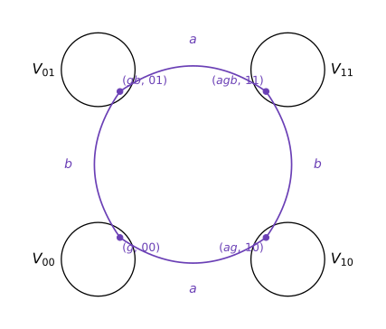
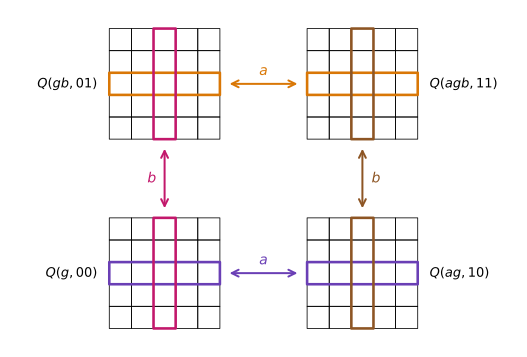
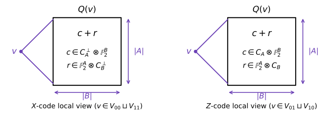

# [Quantum Tanner Codes](@id quantum-tanner-codes)
 
The first asymptotically **good** quantum LDPC codes which CSS codes with constant rate, constant relative distance, and constant-weight stabilizers were obtained by Panteleev and Kalachev ([*Asymptotically good quantum and locally testable classical LDPC codes*](https://arxiv.org/abs/2111.03654)) via notions of products of chain complexes. **Quantum Tanner codes**, introduced by Leverrier and Zémor ([*Quantum Tanner codes*](https://arxiv.org/abs/2202.13641), [*Decoding quantum Tanner codes*](https://arxiv.org/abs/2208.05537)), achieve the same asymptotically code construction through an explicitly two-dimensional geometric picture without use of chain complexes which provides a much simpler perspective on building such codes. They are built on the *left-right Cayley complex* introduced in the locally testable code construction of [dinur2022locally](@cite).
 
## The left-right Cayley complex
 
Start with a finite group ``G`` and two (not necessarily) symmetric generating sets
``A = A^{-1}`` and ``B = B^{-1}`` with ``|A| = |B| = \Delta``. The left-right Cayley complex is a quadripartite graph on the vertex set
 
```math
V = V_{00} \sqcup V_{10} \sqcup V_{01} \sqcup V_{11},
\qquad V_{ij} = G \times \{ij\},
```
 
where each ``a \in A`` acts by *left* multiplication (``A``-edges) and each ``b \in B`` acts by *right* multiplication (``B``-edges): a vertex ``(g, 00)`` is joined to ``(ag, 10)`` for every ``a \in A`` and to ``(gb, 01)`` for every ``b \in B``, and similarly on the other side.
 

 
The four induced bipartite subgraphs are each double covers of ordinary Cayley graphs: the ``A``-edge subgraphs are copies of the double cover of ``\mathrm{Cay}_L(G, A)``, and the ``B``-edge subgraphs are copies of the double cover of ``\mathrm{Cay}_R(G, B)``.
 
The central objects are the **squares**
 
```math
\{(g, 00),\ (ag, 10),\ (gb, 01),\ (agb, 11)\},
\qquad a \in A,\ b \in B,\ g \in G,
```
 
and we write ``Q`` for the set of all of them. Each square has four vertices and each of the ``4|G|`` vertices lies on ``\Delta^2`` squares, giving ``|Q| = |G|\Delta^2``. The **``Q``-neighborhood** ``Q(v)`` of a vertex ``v`` is the set of squares containing ``v``. Since a square through ``v`` is determined by a choice of ``a \in A`` and ``b \in B``, we have ``Q(v) \cong A \times B``: the ``\Delta^2`` squares around a vertex arrange naturally into an ``|A| \times |B|`` grid. The key combinatorial fact is that neighboring vertices have grids that overlap in a controlled way:
 

 
Vertices joined by an ``A``-edge labelled ``a`` share exactly the ``a``-th row of their grids, and vertices joined by a ``B``-edge labelled ``b`` share exactly the
``b``-th column.
 
## The two Tanner codes
 
Fix two classical linear codes ``C_A`` and ``C_B`` of length ``\Delta`` (one bit per element of ``A`` and ``B`` respectively). Qubits live on the squares ``Q``. Following the classical Tanner code recipe, each vertex imposes a *local code* on the ``\Delta^2`` bits of its ``Q``-neighborhood — and since that neighborhood is an ``|A| \times |B|`` grid, the natural local codes are the tensor code ``C_A \otimes C_B`` (matrices whose columns lie in ``C_A`` and rows lie in ``C_B``) and its dual, the *dual tensor code*
 
```math
(C_A \otimes C_B)^{\perp}
 = C_A^{\perp} \otimes \mathbb{F}_2^{B} + \mathbb{F}_2^{A} \otimes C_B^{\perp},
```
 
whose elements are sums ``c + r`` of a matrix ``c`` with columns in ``C_A^{\perp}`` and a matrix ``r`` with rows in ``C_B^{\perp}``.
 

 
The CSS code is defined by two classical Tanner codes living on the two "diagonal" graphs of the complex. Let ``\mathcal{G}_0^{\square}`` be the graph on ``V_{00} \sqcup V_{11}`` with an edge for every square (joining its two even-parity corners), and ``\mathcal{G}_1^{\square}`` the analogous graph on ``V_{01} \sqcup V_{10}``. Then
 
```math
C_0 = \mathrm{Tan}\bigl(\mathcal{G}_0^{\square},\
C_A^{\perp} \otimes \mathbb{F}_2^{B} + \mathbb{F}_2^{A} \otimes C_B^{\perp}\bigr),
\qquad
C_1 = \mathrm{Tan}\bigl(\mathcal{G}_1^{\square},\
C_A \otimes \mathbb{F}_2^{B} + \mathbb{F}_2^{A} \otimes C_B\bigr),
```
 
with the ``X``-checks of ``C_0`` drawn from ``C_A \otimes C_B`` at even-parity vertices and the ``Z``-checks of ``C_1`` drawn from ``C_A^{\perp} \otimes C_B^{\perp}`` at odd-parity vertices. Commutation of the stabilizers reduces to a local statement: whenever an ``X``-check and a ``Z``-check overlap, they overlap on a single shared row or column of their grids, where one restricts to a codeword of ``C_A`` (or ``C_B``) and the other to a codeword of ``C_A^{\perp}`` (or ``C_B^{\perp}``) — so their inner product vanishes, and the pair ``(C_0, C_1)`` forms a valid CSS code.
 
## Parameters
 
With ``n = |Q| = |G|\Delta^2`` qubits and the standard choice ``C_A = [\Delta, \rho\Delta]``, ``C_B = [\Delta, (1-\rho)\Delta]`` for a constant ``\rho \in (0, 1)``, counting parity checks gives
 
```math
k \geq n - 4|G|\rho(1-\rho)\Delta^2 = (1 - 2\rho)^2\, n,
```
 
so the code has **constant rate** whenever ``\rho \neq 1/2``. Every check acts on at most ``\Delta^2`` qubits and every qubit is acted on by at most ``\Delta^2`` checks, so for constant ``\Delta`` the code is **LDPC**.
 
Distance is where the expander graphs enter. Two ingredients are needed:
 
1. **Spectral expansion.** The Cayley graphs ``\mathrm{Cay}_L(G, A)`` and ``\mathrm{Cay}_R(G, B)`` must be Ramanujan, i.e. ``\lambda \leq 2\sqrt{\Delta}``. Edges of ``\mathcal{G}_i^{\square}`` correspond to a simultaneous choice of an ``A``-edge and a ``B``-edge, the two adjacency operators commute, and their eigenvalues multiply — so ``\lambda(\mathcal{G}_i^{\square}) \leq 4\Delta = 4\sqrt{\Delta^2}``, making the Tanner graphs *almost Ramanujan* at degree ``\Delta^2``. This is precisely the role played by the [Morgenstern](@ref morgenstern-graphs) and [LPS](@ref lps-graphs) Ramanujan graphs in this package.
2. **Product expansion.** Because local views decompose as ``x_v = c_v + r_v``, the analysis needs codes where ``|x_v|`` cannot collapse through cancellation between ``c_v`` and ``r_v`` — quantitatively, ``\kappa``-*product expansion*: every local codeword admits a decomposition with ``|x| \geq \kappa\Delta(\lVert c \rVert + \lVert r \rVert)``. Random choices of ``C_A, C_B`` are product expanding with high probability ([Panteleev–Kalachev](https://arxiv.org/abs/2111.03654)), which motivates the random constructions below.
Together these yield constant relative distance, completing the good-qLDPC
parameter trifecta.
 
## Constructing quantum Tanner codes with this package
 
 
## Further reading
 
- Leverrier & Zémor, [*Quantum Tanner codes*](https://arxiv.org/abs/2202.13641) and [*Decoding quantum Tanner codes*](https://arxiv.org/abs/2208.05537)
- [dinur2022locally](@cite) — the left-right Cayley complex and locally testable
  codes with constant rate, distance, and locality.
- Panteleev & Kalachev, [*Asymptotically good quantum and locally testable classical LDPC codes*](https://arxiv.org/abs/2111.03654)
- John Wright's UC Berkeley CS294 *Quantum Coding Theory* lecture notes
  (Spring 2024), Lectures 19–20 provides an excellent, accessible exposition of the
  quantum Tanner construction which this page gratefully follows at a high level.

## References
 
```@bibliography
Pages = ["quantum_tanner.md"]
Canonical = false
```