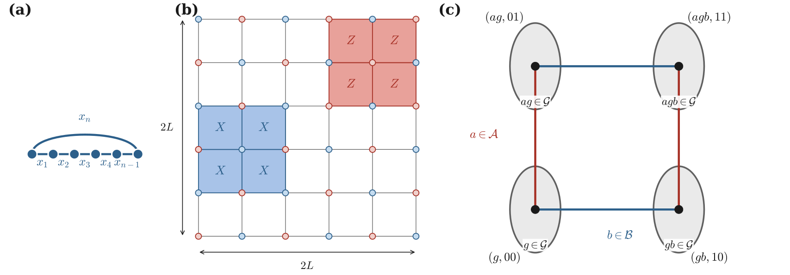
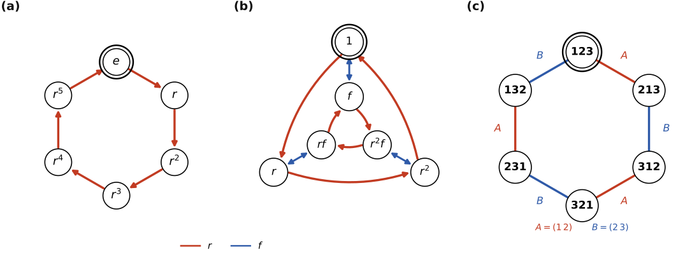
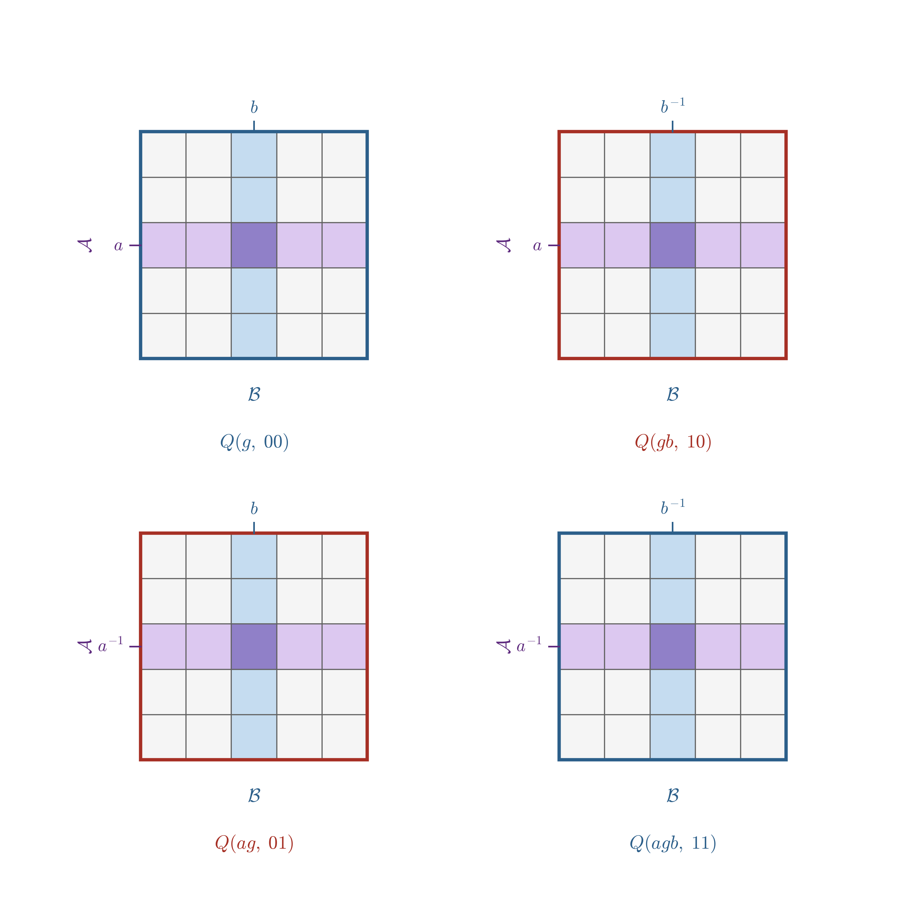
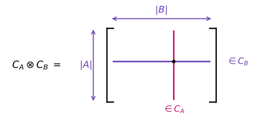
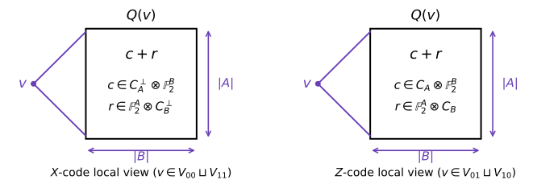

# [Quantum Tanner Codes](@id quantum-tanner-codes)

Quantum Tanner (QT) codes, introduced by Leverrier and Zémor
([*Quantum Tanner codes*](https://arxiv.org/abs/2202.13641),
[*Decoding quantum Tanner codes*](https://arxiv.org/abs/2208.05537)),
form an asymptotically good family of quantum LDPC codes: they can simultaneously
have constant rate, linear distance, and bounded-weight stabilizer checks.

QT codes admit two complementary descriptions:

1. the original **left-right Cayley complex (LRCC)** description, which gives the
   geometric square-complex picture used in the original construction; and
2. the **lifted left-right action** description, in which a small CSS template is
   lifted through commuting left and right regular actions of a finite group.

`QuantumExpanders.jl` supports both descriptions. This page focuses on the LRCC
construction implemented by [`QuantumTannerCode`](@ref). The lifted construction
is documented separately on
[Quantum Tanner Codes via Left-Right Actions](@ref quantum-tanner-left-right-actions).

After reading this page, you should be able to identify the group data, the
local classical codes, the qubits, and the stabilizer supports required by the
LRCC constructor.



*Geometric roadmap from the manuscript [mian2026quantum](@cite): a repetition
code on a cycle, its two-dimensional product, and an LRCC square labelled by
``g\in G``, ``a\in A``, and ``b\in B``. The right panel uses the quadripartite
labels that make the four corners of a square explicit; the bipartite
constructor below uses the corresponding quotient description.*

## Two QT constructors in `QuantumExpanders.jl`

The two high-level constructors represent the same QT-code framework in different
ways, but their inputs obey different constraints.

- [`QuantumTannerCode`](@ref) uses the **bipartite LRCC**. Its sets `A` and `B`
  must be symmetric, must not contain the identity, and must satisfy the total
  non-conjugacy condition. The resulting code has

  ```math
  n = \frac{|G|\,|A|\,|B|}{2}.
  ```

- [`QuantumTannerViaLeftRightActions`](@ref) uses the **lifted algebraic
  description**. Here `A` and `B` are multisets associated with the left and
  right regular actions; repeated elements are allowed and the LRCC total
  non-conjugacy condition is not required. If the two local-code lengths are
  ``n_A`` and ``n_B``, then

  ```math
  n = |G|\,n_A n_B.
  ```

The LRCC description is especially useful when one wants the square-complex
geometry explicitly. The lifted description is often more convenient for
systematic searches over finite groups and local codes.

## Cayley graph intuition

A Cayley graph turns multiplication by a small set of group elements into
edges. Its vertices are the elements of ``G``; an edge labelled by ``s`` joins
``g`` to either ``sg`` or ``gs``, depending on whether a left or right action is
used. The graph therefore depends on both the group and the chosen generators.



*Examples from [mian2026quantum](@cite). The two right panels use the same group
``S_3`` with different generators, illustrating why the generator data are an
essential part of a QT-code instance.*

The LRCC combines a left Cayley action from ``A`` with a right Cayley action
from ``B``. Left and right multiplication commute, which is the algebraic
reason squares can be formed consistently.

## The bipartite left-right Cayley complex

Let ``G`` be a finite group and let ``A,B \subseteq G`` be symmetric generating
sets,

```math
A=A^{-1}, \qquad B=B^{-1}.
```

For the bipartite LRCC used by [`QuantumTannerCode`](@ref), the generating sets
must also satisfy

```math
1_G \notin A,\qquad 1_G \notin B,
```

and the **total non-conjugacy (TNC)** condition

```math
g^{-1}ag \neq b
\qquad
\text{for every } g\in G,\ a\in A,\ b\in B.
```

In particular, TNC implies ``A\cap B=\varnothing``. In typical searches one also
requires

```math
\langle A\cup B\rangle = G
```

so that the construction uses the full group.

The vertex set consists of two copies of ``G``,

```math
V = V_0 \sqcup V_1,
\qquad
V_i = G\times\{i\}.
```

For each ``a\in A``, an ``A``-edge connects

```math
(g,0) \sim (ag,1),
```

while for each ``b\in B``, a ``B``-edge connects

```math
(g,0) \sim (gb,1).
```

These are bipartite double covers of the left and right Cayley graphs,
respectively.

## Squares and qubits

The faces of the complex are the four-cycles

```math
q(g,a,b)
=
\{(g,0),\ (ag,1),\ (gb,1),\ (agb,0)\},
\qquad
g\in G,\ a\in A,\ b\in B.
```

Each square carries one physical qubit.

Because the generating sets are symmetric, the same geometric square has
multiple equivalent descriptions. After quotienting these redundant
descriptions, the number of physical qubits is

```math
|Q| = \frac{|G|\,|A|\,|B|}{2}.
```

For every vertex ``v``, the incident squares are naturally indexed by

```math
Q(v) \cong A\times B.
```

Thus the local view around a vertex is an ``|A|\times|B|`` grid.



*Local ``A\times B`` views from [mian2026quantum](@cite). An ``A``-edge shares a
row, while a ``B``-edge shares a column. Blue-bordered vertices support
``X``-type constraints and red-bordered vertices support ``Z``-type
constraints.*

This local grid is the key geometric feature of the LRCC. Neighboring vertices
share an entire row or column rather than a single qubit, which makes it
possible to impose commuting ``X``- and ``Z``-type constraints.

## Local tensor codes

Choose two binary classical codes

```math
C_A \subseteq \mathbb{F}_2^A,
\qquad
C_B \subseteq \mathbb{F}_2^B.
```

Let ``G_A`` and ``G_B`` be generator matrices for these codes and let ``H_A`` and
``H_B`` be parity-check matrices, so the rows of ``H_A`` and ``H_B`` generate the
corresponding dual spaces.

The natural code on the local ``A\times B`` grid is the tensor code

```math
C_A\otimes C_B.
```



In the implementation of [`QuantumTannerCode`](@ref),

- the rows of ``G_A\otimes G_B`` generate the local **Z-type stabilizers** on
  ``V_0``; and
- the rows of ``H_A\otimes H_B`` generate the local **X-type stabilizers** on
  ``V_1``.

Equivalently, the two local stabilizer spaces are

```math
C_A\otimes C_B
\qquad\text{and}\qquad
C_A^\perp\otimes C_B^\perp.
```



Why do the stabilizers commute? Whenever an ``X``- and a ``Z``-type local view
overlap, their intersection is a row or a column of the local grid. On that
shared slice, one restriction lies in a classical code and the other lies in
its dual, so their binary inner product vanishes.

## Parameters

For the standard asymptotic setting, take

```math
|A|=|B|=\Delta,
```

with local-code dimensions

```math
\dim C_A = \rho\Delta,
\qquad
\dim C_B = (1-\rho)\Delta.
```

The number of physical qubits is

```math
n=\frac{|G|\Delta^2}{2}.
```

Counting the local ``X``- and ``Z``-type generators gives the familiar rate
lower bound

```math
k \geq (1-2\rho)^2 n.
```

Thus the construction has constant rate whenever ``\rho\neq 1/2``. For constant
``\Delta``, both stabilizer weight and qubit degree remain bounded, so the family
is LDPC.

Linear distance requires additional expansion hypotheses. Two ingredients enter
the original analysis:

1. **Spectral expansion.** The Cayley graphs generated by ``A`` and ``B`` should
   have strong spectral expansion. Explicit Ramanujan constructions such as
   [Morgenstern](@ref morgenstern-graphs) and [LPS](@ref lps-graphs) provide
   useful sources of generating sets.

2. **Product expansion.** The local classical codes must prevent cancellation
   between the row and column components of a local view. Random local codes
   satisfy the required product-expansion property with high probability in the
   asymptotic construction.

Together these ingredients yield constant relative distance.

## Constructing an LRCC quantum Tanner code

[`QuantumTannerCode`](@ref) takes a finite group, two LRCC generating sets, and
one classical code pair for each side:

```julia
QuantumTannerCode(
    G,
    A,
    B,
    ((H_A, G_A), (H_B, G_B)),
)
```

Before constructing the code, check that:

- `length(A) == size(H_A, 2) == size(G_A, 2)` and likewise on the `B` side;
- each local pair satisfies ``H_AG_A^\mathsf{T}=0`` or
  ``H_BG_B^\mathsf{T}=0`` over ``\mathbb F_2``;
- `A` and `B` are symmetric and exclude the identity; and
- the pair satisfies total non-conjugacy.

These are mathematical requirements of the LRCC presentation, not merely input
formatting conventions.

Here is a small explicit example using ``G=C_3\times S_3`` and the ``[6,3,3]``
classical code on both sides:

```jldoctest quantum-tanner-lrcc
julia> using QuantumExpanders, Oscar, QECCore

julia> G = small_group(18, 3);

julia> r, s, t = Oscar.gens(G);

julia> A = [s, s^2, t, t^2, r*t^2, r];

julia> B = [r*s, r*s^2, s*t, s^2*t^2, r*s*t^2, r*s^2*t^2];

julia> H633 = [1 0 0 0 1 1;
               0 1 0 1 0 1;
               0 0 1 1 1 0];

julia> G633 = [0 1 1 1 0 0;
               1 0 1 0 1 0;
               1 1 0 0 0 1];

julia> c = QuantumTannerCode(
           G,
           A,
           B,
           ((H633, G633), (H633, G633)),
       );

julia> code_n(c), code_k(c)
(324, 8)
```

The parity-check matrices can then be obtained in the usual way:

```julia
hx, hz = parity_matrix_xz(c)
```

## When to use each construction

Use [`QuantumTannerCode`](@ref) when:

- you want the original LRCC geometry explicitly;
- you already have symmetric generating sets satisfying TNC; or
- you are searching directly over LRCC generating-set pairs.

Use [`QuantumTannerViaLeftRightActions`](@ref) when:

- you want to work directly with the lifted left/right regular actions;
- your generating data are multisets or contain repeated elements;
- you want to vary the two local-code lengths independently; or
- you want to search over local-code permutations and group lifts without
  imposing the LRCC TNC condition.

## Further reading

- Leverrier & Zémor, [*Quantum Tanner codes*](https://arxiv.org/abs/2202.13641)
  and [*Decoding quantum Tanner codes*](https://arxiv.org/abs/2208.05537).
- [dinur2022locally](@cite) — the left-right Cayley complex and locally testable
  codes with constant rate, distance, and locality.
- Panteleev & Kalachev,
  [*Asymptotically good quantum and locally testable classical LDPC codes*](https://arxiv.org/abs/2111.03654).

## References

```@bibliography
Pages = ["quantum_tanner.md"]
Canonical = false
```
